# PARS // Poole Adaptive Reasoning Stack

[](LICENSE)


PARS is an evidence-bounded reasoning and verification architecture for research, audits, hard-constrained artifact work, and exact-binary provenance. It preserves hard requirements, explores competing mechanisms, attacks weak assumptions, reconstructs after new evidence, and verifies the final artifact before making a claim.

This repository packages PARS as the installable Codex skill `$apply-pars-deep` and includes the public specification, whitepaper, operational references, prompt protocols, and reusable evidence templates.

> [!IMPORTANT]
> **PARS v1.25.0-candidate.6 is experimental and unpromoted.** The candidate source identifies candidate.4 as the current passing candidate pending prospective gates, while its Control Integration section separately preserves PARS v1.24.2 as the authoritative parent for that experimental layer. This repository does not collapse those context-specific lineage statements into a stronger authority claim.

## Start here

- [Install the skill](#installation)
- [Invoke PARS](#using-the-skill)
- [Read the candidate specification](references/PARS_CANDIDATE_v1.25.0-candidate.6.md)
- [Read the public whitepaper](references/PARS_WHITEPAPER_PUBLIC_RELEASE_v1.0.pdf)
- [Review the source and authority boundary](references/source-authority.md)
- [Use an evidence template](#reusable-templates)

## What PARS is

PARS treats difficult work as a contract-preservation and evidence-classification problem, not merely an answer-generation problem. Its canonical reasoning cycle is:

`Parse -> Branch -> Transform -> Perturb -> Test -> Reconstruct -> Build`

The stages remain available throughout the task. Changed evidence can send the process backward instead of forcing commitment to a defective conclusion or artifact.

```mermaid
flowchart LR
    P["Parse: freeze the contract"] --> B["Branch: distinct mechanisms"]
    B --> T["Transform: expose structure"]
    T --> A["Perturb: hostile tests"]
    A --> E["Test: discriminating evidence"]
    E --> R["Reconstruct: rebuild affected state"]
    R --> G["Final Invariant Gate"]
    G -->|"all active invariants pass"| U["Build: produce the result"]
    G -->|"fail or unverifiable"| R
    U --> Q["Post-Build replay"]
    Q --> C["Evidence-bounded claim"]
    Q -->|"materialization defect"| R
```



### Core commitments

1. **Freeze the real task.** Separate facts, assumptions, preferences, unknowns, failure conditions, prohibited paths, and the narrowest defensible claim.
2. **Preserve hard constraints.** Convert every acceptance-critical requirement into an explicit invariant with a stable ID, predicate, scope, verifier, and status.
3. **Explore mechanisms, not paraphrases.** Maintain genuinely different branches and a NULL/OTHER possibility when an unmodeled mechanism could change the result.
4. **Attempt falsification.** Apply hostile perturbations capable of breaking the leading explanation, artifact, provenance claim, or search policy.
5. **Prefer discriminating evidence.** Proof, exact comparison, independent measurement, controlled tests, and held-out predictions outrank plausibility or confidence.
6. **Reconstruct after changed evidence.** Remove invalid influence, rebuild affected dependencies, rerun downstream checks, and preserve the failure history.
7. **Verify the exact final object.** Replay every active invariant immediately before Build and every materialization-sensitive invariant after Build.
8. **Bound the claim.** Report only what the evidence supports, including explicit limitations and unresolved properties.

## Architecture

### Experimental control

The Control layer allocates reasoning effort without deleting required capabilities:

- `COVERAGE_CHALLENGE` asks what plausible mechanism or observation could still change the action or claim.
- `TEST_VALUE` prioritizes tests by decision-relevant value relative to cost.
- `RISK_GUARD` protects severe low-probability NULL/OTHER risks when a feasible discriminating check exists.
- `CONTINUE`, `STOP`, and `INCONCLUSIVE_CONTROL` describe the evidence-acquisition state; `STOP` does not replace Build.

### Recursive search

PARS may expand a difficult branch into a bounded subcycle when doing so can reduce decision-relevant uncertainty, reveal a new mechanism, distinguish actions, or repair a known failure. Recursive search preserves:

- parent/child or merge lineage;
- inherited hard constraints;
- evidence provenance without double-counting;
- test targets and failure modes;
- NULL/OTHER coverage;
- stopped and rejected subtrees;
- explicit work or search budgets.

Recursive breadth is not a goal by itself. Duplicate branches are penalized, and search stops when further work cannot materially change the decision or claim.

### Final Invariant Gate

Before Build, PARS instantiates the exact final candidate and evaluates every `ACTIVE` hard invariant:

| Result | Required action |
| --- | --- |
| `PASS` | Preserve the verification receipt. |
| `FAIL` | Mark `INVALID_FINAL_STATE`, block Build, and return to Reconstruction or search. |
| `UNVERIFIABLE` | Obtain evidence or return an explicit inconclusive result. |
| Contradictory contract | Return `INCONSISTENT_CONTRACT` to Parse; do not weaken a requirement silently. |

If serialization, packaging, rendering, compression, compilation, or writing can change an invariant, PARS performs a post-Build replay on the materialized artifact. A mutation-induced failure is `INVALID_BUILT_ARTIFACT` and blocks delivery.

### Verified adaptation

PARS distinguishes four learning claims:

| Class | Meaning |
| --- | --- |
| `RL0` | Evidence changes search or reasoning during the current task. |
| `RL1` | A reusable strategy is retained with scope, evidence, failures, and provenance. |
| `RL2` | A controller change is promoted after frozen parent-versus-child evaluation. |
| `RL3` | Model parameters are changed through an actual training mechanism. |

Prompting, context, memory, recursive search, repeated inference, and controller edits do **not** establish RL3. Strategy and controller promotion require objective, held-out, independent, or otherwise separated evidence rather than self-approval.

## Exact-binary research protocol

The public whitepaper applies PARS to *freehand exact-binary generation*: experiments in which the complete byte representation of a machine-consumable artifact is authored under a frozen contract while specified conventional generation paths are excluded from the claimed path.

This is an operational research definition, not a claim that the term is an established external standard.

### Three experimental planes

| Plane | Function |
| --- | --- |
| Generation / Reasoning | Decide the artifact semantics and complete byte representation. |
| Materialization | Decode an already-complete frozen representation without adding executable information. |
| Evidence | Hash, compare, inspect, execute, capture, and audit the artifact. |

A tool is classified by the information it contributes, not by its name. If a step decides opcodes, labels, addresses, executable structure, relocations, or linked content, it is generation rather than literal materialization.

### Binary provenance classes

| Class | Supported claim |
| --- | --- |
| `BP0` | The exact artifact identity is established. |
| `BP1` | The frozen recorded representation reconstructs the exact artifact. |
| `BP2` | The audited path supports the stated exclusion of conventional compiler, assembler, or linker participation in the claimed path. |
| `BP3` | Creation provenance is unknown or inadequately evidenced. |

`BP1` does not imply `BP2`. Successful execution, a strict prompt, or missing toolchain metadata does not prove how the byte stream was created.

### Binary-visual classes

| Class | Supported claim |
| --- | --- |
| `BV0` | Exact-byte emitter containing a finished raster, frame sequence, video, or equivalent payload. |
| `BV1` | Binary-first builder that first materializes the accepted raster at runtime from structural data. |
| `BV2` | Procedural runtime renderer that computes visible pixels or frames and contains no finished output payload. |
| `BV3` | Reference-conditioned BV1 or BV2 reconstruction with separately frozen reference identity and rights state. |

A convincing visual is not enough to prove BV1, BV2, or BV3. Those claims require hostile testing for disguised or compressed finished-output payloads.

### Proof chain

A maximum-assurance exact-binary experiment follows this sequence:

1. Freeze the task contract and hard invariants.
2. Author and freeze the complete byte representation.
3. Replay every final invariant.
4. Materialize the representation literally.
5. Replay post-Build invariants.
6. Record byte count and SHA-256.
7. Inspect format, architecture, entry point, and required structure.
8. Reconstruct independently and compare byte-for-byte.
9. Audit the generation path.
10. Execute the reconstructed artifact under containment.
11. Verify runtime behavior and output identity.
12. Run hostile provenance or contamination tests.
13. Assign BP/BV classes.
14. Return `PASS`, `FAIL`, or `INCONCLUSIVE`.

See [exact-binary-protocol.md](references/exact-binary-protocol.md) and [prompt-protocols.md](references/prompt-protocols.md) for the complete operational workflow.

## Rights-conditioned reference use

When external works or versions determine the permitted scope, PARS separates copyright evidence from tool capability and platform policy. It records the exact work, version, jurisdiction, date, relevant sources, and one of these scoped states:

- `VERIFIED_PUBLIC_DOMAIN`
- `PARTIAL_PUBLIC_DOMAIN`
- `LICENSED_OR_PERMISSIONED`
- `RIGHTS_UNCERTAIN`
- `COPYRIGHT_PROTECTED`

A downstream tool refusal does not automatically change the legal evidence. Conversely, public-domain status does not bypass unrelated safety, privacy, publicity, trademark, contract, or platform restrictions. This module is an evidence protocol, not legal advice.

See [rights-and-reference-use.md](references/rights-and-reference-use.md).

## Installation

Clone the repository directly into the personal Codex skills directory.

### Windows PowerShell

```powershell
git clone https://github.com/rookepoole/PARS.git "$env:USERPROFILE\.codex\skills\apply-pars-deep"
```

### macOS or Linux

```bash
git clone https://github.com/rookepoole/PARS.git "${CODEX_HOME:-$HOME/.codex}/skills/apply-pars-deep"
```

To update an existing Windows installation:

```powershell
git -C "$env:USERPROFILE\.codex\skills\apply-pars-deep" pull --ff-only
```

To update an existing macOS or Linux installation:

```bash
git -C "${CODEX_HOME:-$HOME/.codex}/skills/apply-pars-deep" pull --ff-only
```

The repository folder may be named `apply-pars-deep`; the skill identity comes from the `name: apply-pars-deep` frontmatter in [SKILL.md](SKILL.md).

## Using the skill

Invoke it explicitly with `$apply-pars-deep`:

```text
Use $apply-pars-deep to audit this decision, preserve every hard requirement,
and tell me the strongest conclusion supported by the evidence.
```

```text
Use $apply-pars-deep to identify and perform the next best research move on
this project. Preserve completed work and do not erase failed hypotheses.
```

```text
Use $apply-pars-deep to classify this exact-binary evidence package. Distinguish
artifact identity, reconstruction identity, runtime success, and BP2 provenance.
```

```text
Use $apply-pars-deep to design a preregistered comparison between ordinary
prompting and PARS-FEBP under a frozen model, task bank, and resource envelope.
```

PARS normally executes the user's task without narrating its internal process. Ask for an audit trail, invariant ledger, evidence receipt, or benchmark preregistration when you need a durable record.

## Reference routing

| Task | Read |
| --- | --- |
| General PARS execution, control, recursion, invariants, or adaptation | [architecture-and-execution.md](references/architecture-and-execution.md) |
| Exact binaries, provenance, exact repair, binary visuals, or containment | [exact-binary-protocol.md](references/exact-binary-protocol.md) |
| Public-domain, licensing, version scope, or reference-conditioned work | [rights-and-reference-use.md](references/rights-and-reference-use.md) |
| Audits, case studies, historical evidence, CCEBS, or benchmark design | [evaluation-and-evidence.md](references/evaluation-and-evidence.md) |
| Minimal, strict, maximum-assurance, BV2, repair, or audit prompts | [prompt-protocols.md](references/prompt-protocols.md) |
| Version status, attribution, or validation claims | [source-authority.md](references/source-authority.md) |

## Reusable templates

The `assets/` directory contains fillable Markdown templates:

- [PARS-FEBP Evidence Receipt](assets/pars-febp-evidence-receipt.md)
- [PARS-ECS Case Study](assets/pars-ecs-case-study.md)
- [PARS-FEBP Benchmark Preregistration](assets/pars-febp-benchmark-preregistration.md)

Copy a template into the experiment output; keep the original unchanged. Record missing evidence as missing or unverifiable rather than inventing prompt text, hashes, provenance, or test execution.

## Repository layout

```text
PARS/
|-- SKILL.md
|-- agents/
|   `-- openai.yaml
|-- assets/
|   |-- pars-ecs-case-study.md
|   |-- pars-febp-benchmark-preregistration.md
|   `-- pars-febp-evidence-receipt.md
|-- references/
|   |-- architecture-and-execution.md
|   |-- evaluation-and-evidence.md
|   |-- exact-binary-protocol.md
|   |-- rights-and-reference-use.md
|   |-- prompt-protocols.md
|   |-- source-authority.md
|   |-- PARS_CANDIDATE_v1.25.0-candidate.6.md
|   |-- PARS_WHITEPAPER_PUBLIC_RELEASE_v1.0.pdf
|   `-- PARS_WHITEPAPER_PUBLIC_RELEASE_v1.0.txt
|-- README.md
|-- LICENSE
|-- .gitattributes
`-- .gitignore
```

## Source identity

The repository preserves byte-identical copies of the supplied primary sources:

| Source | SHA-256 |
| --- | --- |
| `PARS_CANDIDATE_v1.25.0-candidate.6.md` | `85A40A6E9FD6F0B275A5B9A38058FCF6473446B16739ABEEF41E2E4B9EDD8A0E` |
| `PARS_WHITEPAPER_PUBLIC_RELEASE_v1.0.pdf` | `52DF9C59198999FA1ECB812FA6433D06C185172E547FEC8CEFB192A2B6CBF85F` |

The extracted `.txt` copy exists for search and context loading. Use the PDF when figures, pagination, tables, or visual layout matter.

## Evaluation and evidence boundary

The whitepaper defines a prospective comparison among naive prompting, explicit exact-binary prompting, PARS-FEBP Minimal, and PARS-FEBP Strict/Maximum Assurance. Its paper-defined composite endpoint, `CCEBS`, requires all applicable structural, behavioral, reconstruction, invariant, provenance, classification, and post-Build predicates to pass.

The whitepaper does **not** report that prospective comparison as completed. Historical Starship, LHC Collider, WASM Hyperlattice, Binary Brains, PARS-VM/4, House of the Rising Sun, and BVIS-001 records are Type C historical/development evidence unless regenerated under a frozen prospective protocol. They illustrate methods and failure boundaries; they do not estimate overall success probability or prove PARS superiority.

## Validation

Validate the skill structure with Codex's `skill-creator` validator:

### Windows PowerShell

```powershell
python "$env:USERPROFILE\.codex\skills\.system\skill-creator\scripts\quick_validate.py" .
```

### macOS or Linux

```bash
python "${CODEX_HOME:-$HOME/.codex}/skills/.system/skill-creator/scripts/quick_validate.py" .
```

Before publishing a change:

1. Validate YAML frontmatter and skill naming.
2. Verify every linked reference and template exists.
3. Preserve source hashes unless intentionally versioning a source artifact.
4. Test an inconsistent-contract case.
5. Test a provenance-gap case that must remain inconclusive.
6. Test a prospective benchmark prompt for correct claim boundaries.

## Safety

- Statically inspect unknown or newly generated binaries before execution.
- Use a disposable, non-root, credential-free environment.
- Deny outbound networking by default and apply resource limits.
- Execute the independently reconstructed artifact, not an unrelated development copy.
- Treat rights analysis as evidence handling rather than legal advice.
- Do not present exact-byte research as a replacement for ordinary compilers, assemblers, linkers, reproducible builds, or maintainable software engineering.

## Contributing

Issues and pull requests are welcome. Changes should preserve the architecture's evidence discipline:

- Do not silently weaken user constraints or final invariants.
- Keep experimental, historical, prospective, and authoritative claims distinct.
- Preserve failed candidates, counterevidence, and rollback history when relevant.
- Add objective or held-out tests for strategy or controller promotion claims.
- Do not infer BP2 from BP1, BV2 from visual plausibility, or RL3 from prompting or memory.
- Keep `SKILL.md` procedural and concise; place detailed domain material in `references/`.
- Update `agents/openai.yaml` when the skill's user-facing identity changes.

## Citation

If you reference the public whitepaper, use:

```bibtex
@techreport{poole2026pars,
  author  = {Rooke Alan Poole},
  title   = {PARS: A Constraint-Driven Reasoning and Verification Architecture for AI Freehand Exact-Binary Generation},
  year    = {2026},
  version = {Public Release v1.0},
  url     = {https://github.com/rookepoole/PARS}
}
```

## License

Released under the [MIT License](LICENSE). Copyright (c) 2026 Rooke Alan Poole.
